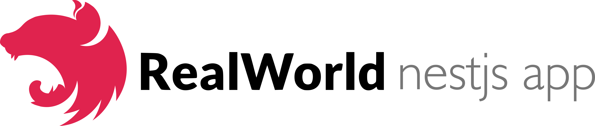
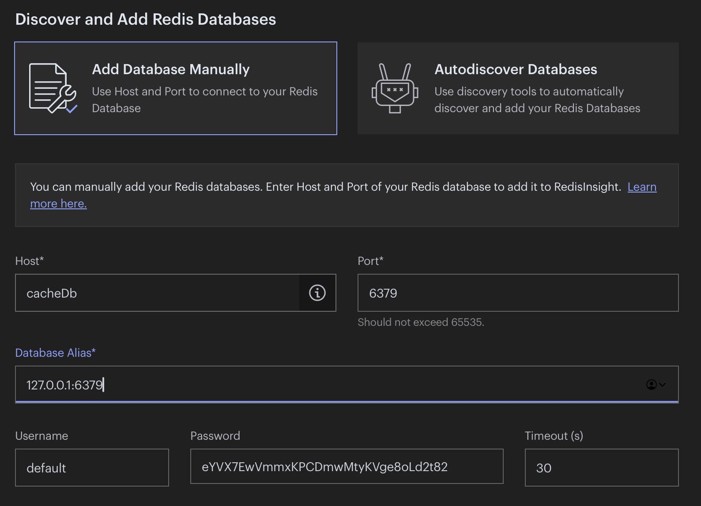
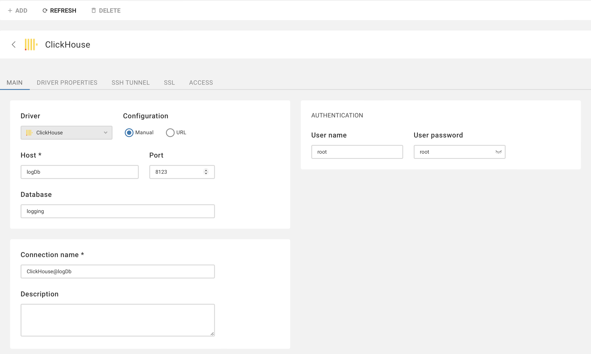

# 

> ### NestJS codebase containing real world examples (CRUD, auth, advanced patterns, etc) that adheres to the [RealWorld](https://github.com/gothinkster/realworld) spec and API.


### [Demo](https://demo.realworld.io/)&nbsp;&nbsp;&nbsp;&nbsp;[RealWorld](https://github.com/gothinkster/realworld)

This codebase was created to demonstrate a fully fledged fullstack application built with **NestJs** including CRUD operations, authentication, routing, pagination, and more.

We've gone to great lengths to adhere to the **NestJs** community styleguides & best practices.

For more information on how to this works with other frontends/backends, head over to the [RealWorld](https://github.com/gothinkster/realworld) repo.


## Installation

To install the application:

```shell
npm ci
```

To start the local database and run the migrations:

```shell
npm run compose:up
# or manually
docker compose up --remove-orphans -d
```

To stop the local database:

```shell
npm run compose:down
# or manually
docker compose down --remove-orphans
```

To completely reset the docker containers (this will delete container volumes):

```shell
npm run compose:destroy
# or manually
docker compose down --rmi local --remove-orphans -v
```

Another way to reset the database is to run the refresh command:

```shell
npm run compose:refresh
# or manually
npm run compose:destroy && npm run compose:up
```


## Running the app

```shell
# development
npm start

# watch mode
npm run start:dev

# production mode
npm run start:prod
```


## Local development

Once the containers and the app are running, you can access the following services:

Backend:
- [localhost:3001/swagger](http://localhost:3001/swagger) for API docs

Docker services:
- [localhost:25000](http://localhost:25000) for redis insight cacheDb (requires setup)
- [localhost:25001](http://localhost:25001) for pgweb cockroachdb devDb
- [localhost:25002](http://localhost:25002) for pgweb postgres testDb
- [localhost:25003](http://localhost:25003) for dbeaver clickhouse logDb (requires setup)
- [localhost:18080](http://localhost:18080) for cockroachdb manager

How to set-up redis insight:



How to set-up clickhouse:




## Test

```shell
# unit tests
npm test

# e2e tests
npm run test:e2e

# test coverage
npm run test:cov
```


## License

Nest is [MIT licensed](LICENSE).
